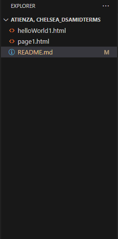
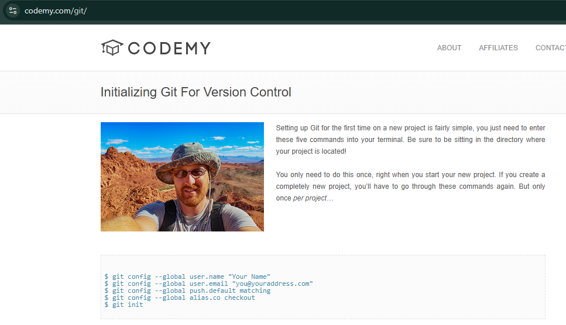
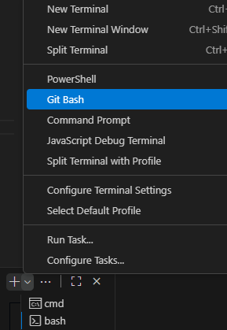
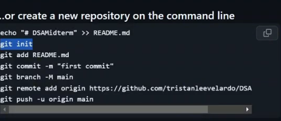

# HELLO WORLD

plain lang na paragraph

# STEP-BY-STEP INSTRUCTION

1. Download and install visual studio (vs) code
https://code.visualstudio.com/download
download the one that fits your setup.

2. Download and install git
https://git-scm.com/
download the one that fits your setup.

3. Open VS Code, then click ‘Agree’ and keep clicking ‘Next’ until it’s done.

4. Search if your vs code and git are already install in your computer.

5. Add a new folder to your desktop, name it "your name_DSAmidterms"

6. Make sure you have github account

7. Create a dummy file.

8. Go to directory, type cmd

9. You should see the "your name_DSAmidterms", beside >, put "code ." then enter.

10. After that, go to View, Terminal in the upper-left part.

11. Look at the lower-right part, click the down arrow button, then select Command Prompt.

12. Check if you are in the desired folder.

13. In the upper-left corner, click File, Auto Save. Make sure there’s a check mark beside Auto Save so you won’t have to save manually in the future.

14. Then, look at the left panel, find the Extensions icon (the box), and search for ‘Conventional Commits’ to download it. After that, search for ‘Source Control’ in the Extensions tab, install it, and wait for the installation to finish.

15. Sometimes, ‘Source Control’ is already installed by default in VS Code when your GitHub account is logged in.

16. If your GitHub account isn’t logged in yet, go to the lower-left part, find the Accounts icon, and log in to your GitHub account.

17. Then, turn on cloud changes.

18. Once all extensions are installed, right-click here.

19. Click ‘New File,’ then name them ‘helloWorld.html’ and ‘README.md. separate files.

20. Next, go to GitHub. We need a repository — click ‘New,’ then in the repository name field, type ‘DSAmidterm.’ Set it to public, and then click ‘Create repository.’

21. Go to 'codemy.com/git/'.

22. Before entering this in your terminal, look for the drop-down button and select Git Bash.

23. Make sure you click Git Bash, Git Bash is colorful.

## Copy and Paste

24. Copy 'git init' then paste and enter.

25. Copy 'git config --global user.name "Your Name"' then paste and enter.

26. Copy 'git config --global user.email "you@youraddress.com"' then paste and enter.

27. Copy 'git config --global push.default matching' then paste and enter.

28. Copy 'git config --global alias.co checkout' then paste and enter.

29. When you’re done, go to the repository and look for this.

30. Just copy and paste everything that’s included there.

31. After that, you should see content in your GitHub repository.

32. To push the new file, click Source Control, then select Conventional Commits (the circle icon). Choose ‘feat,’ select ‘none,’ click :sparkles:, then press Enter three times. then click sync changes.

33. Then, go to GitHub, reload the page, and appreciate your work.

## MarkDown (.md)

34. go to README.md, type '# hello world'.

output:

# hello world

link for mdguide, basic syntax

35. https://www.markdownguide.org/basic-syntax/

### hello sir

